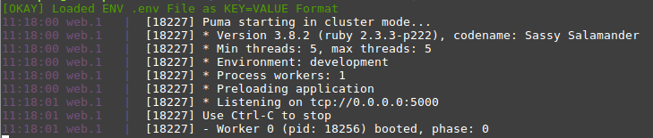
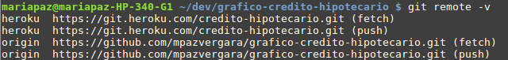

#  Formulario de Simulación de un Crédito Hipotecario

Simula tu Crédito Hipotecario y observa estos resultados reflejados en un gráfico que muestra el dividendo en función de los años de plazo.

## Pruébalo

[Ingresar al formulario](https://credito-hipotecario.herokuapp.com/)


## Para Comenzar

### Prerequisitos

[Heroku CLI](https://devcenter.heroku.com/articles/heroku-cli)

[Bundler](http://bundler.io/)

[Ngrok](https://ngrok.com/download)


### Instalación

Al clonar el proyecto, crear un archivo .env en donde se guardará la API_KEY necesaria para conectarse a la API de BCI, en este archivo escribir:

```
BCI_API_KEY=tu_api_key
```

Para obtener tu API KEY debes crear una cuenta en [BCI Developers](https://developers.bci.cl), luego en aplicaciones crear una nueva aplicación y así otener un ID de cliente asociado (que es tu API KEY).

La aplicación se suscribe automáticamente a todos los productos, por lo que si ya tienes una aplicación creada puedes usar el API KEY de esa misma aplicación.

En el terminal, si no lo has hecho antes, escribe `bundle install` para instalar todas las gemas requeridas y luego de eso escribe `heroku local` para ver tu proyecto en localhost.

En la terminal se debería ver algo como esto:


Se muestra que "Listening on tcp://0.0.0.0:5000" implica que el proyecto esta corriendo en el puerto 5000 en localhost. Para mostrar nuestro servidor local a cualquier persona en internet podemos generar una url con ngrok (seguir instrucciones de instalación en el link más arriba), abrir un nuevo terminal y escribir:

```
ngrok http 5000
```

Esto mostrará una dirección url que podrás usar en tu navegador para observar las respuestas de tu proyecto.


## Deployment

Puedes usar [heroku](https://dashboard.heroku.com/) para subir tu proyecto, para esto crea una nueva aplicación desde la página y luego desde el terminal dentro de la carpeta de tu repositorio escribir:

```
$ heroku git:remote -a NOMBRE-DE-TU-APP
```

Al escribir `git remote -v` debería aparecer algo como esto:



Significa que ya tenemos nuestra app conectada con el repositorio.

En este caso además usamos una API_KEY, esta también hay que guardarla en la app de heroku, así que escribe el siguiente código en terminal:

```
$ heroku config:set BCI_API_KEY=tu_api_key
```

Y ahora para subir el proyecto a la página, hay que escribir lo siguiente:

```
$ git push heroku master
```

Y para acceder a tu página sería algo como https://NOMBRE-DE-TU-APP.herokuapp.com
